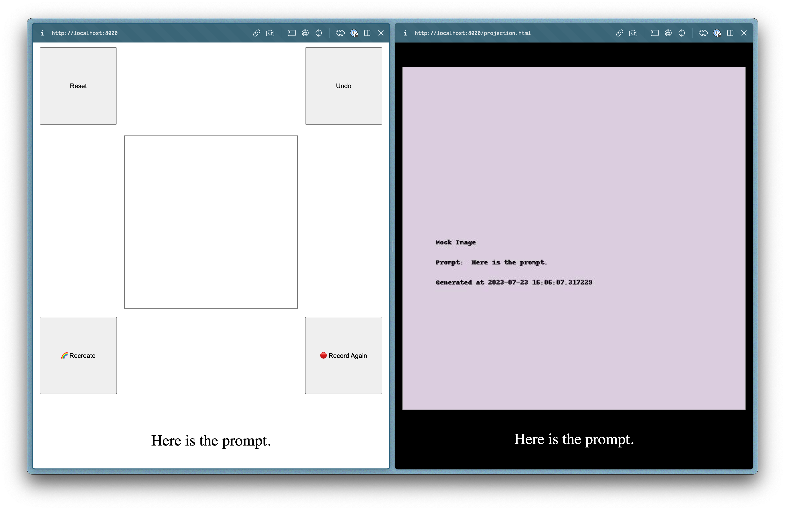

# conscious-canvas

Art Project for Camp Humans Being at Burning Man 2023

## Getting Started

1. Ensure that Python 3.10+ is installed. Newer versions of Python will probably work.
   ```
   python --version
   ```
1. Create a virtual env, activate it, and install this package with the `AR` environment variable
   ```
   python -m venv venv
   source venv/bin/activate
   AR=/usr/bin/ar pip install -e .
   ```
1. [Install FFmpeg](https://github.com/kkroening/ffmpeg-python#installing-ffmpeg).
1. Run the app:
   - For developing on a MacBook without Stable Diffusion, run in mock mode:
     ```
     MOCK_A1111=True ./run.sh
     ```
   - If running Stable Diffusion via A1111:
     ```
     # run a1111 first
     ./webui.sh --api --xformers --medvram

     # then run here
     ./run.sh
     ```
1. There are two entrypoints for the app:
   - The iPad sketching interface runs at http://localhost:8000 (left)
   - The projector display runs at http://localhost:8000/projection.html (right)
     

### Random notes

- SSL localhost is necessary to get mic recording working on mobile Safari.
  - How to set up SSL localhost on Ubuntu and Mac: https://deliciousbrains.com/ssl-certificate-authority-for-local-https-development/

### TODO

In rough order of priority, annotated with difficulty. Things marked as **Required** must be finished before the Burn.

- [x] [Hard] Prevent microphone permission popup
- [x] [Easy] **Required** Prompt should be editable with keyboard (accessibility -- some people cannot speak)
- [ ] [Medium] **Required** NSFW filter (must be easy to switch on/off)
- [x] [Easy] Filter out special prompt tokens like `[Music]` or `[Laughter]`
- [x] [Easy] Add a button to clear the current art piece from the projector
  - Why? Sometimes we generate a really gross/disturbing image and we need an fast way to clear it.
- [x] [Medium] Guest should be able to generate without a sketch
- [x] [Hard] Guest should be able to toggle showing their sketch side-by-side or transparently-overlayed with the generated art piece
- [x] [Medium] Add eraser tool
- [ ] [Hard] Store previous sketches / prompts / images. Guests should be able to reload a previous sketch
- [ ] [Hard] Design upgrade: make the iPad interface look beautiful ✨
  - Aleks: I'd like a handdrawn feel like this: https://chr15m.github.io/DoodleCSS/
- [ ] [Hard] Ask guest for email after creating art piece so we can send them their art after the Burn
  - Do we want to ask their name? Aleks thinks probably not but 🤷‍♂️
