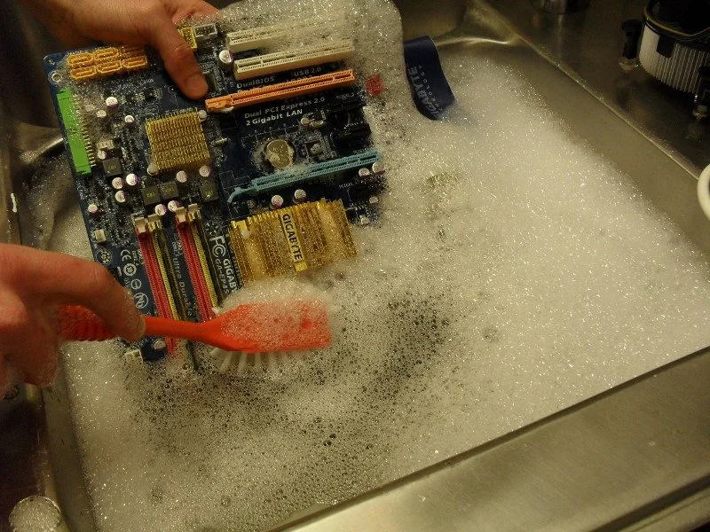
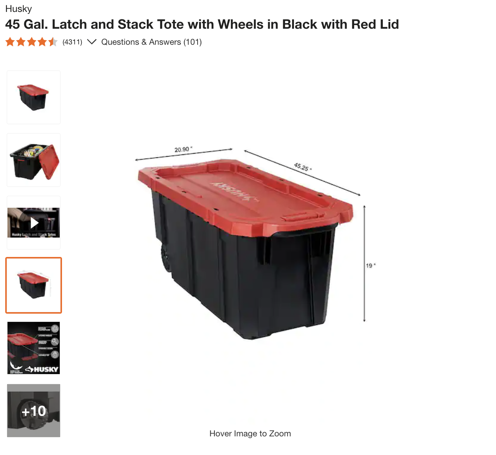

# Bringing AI Art to the Playa

This year I brought an interactive art experience to Burning Man. The premise was simple: you imagine an art piece, use your finger to draw a rough sketch, speak to describe the art you envision, and viola! Our magic AI turns you into a modern-day Picasso.

> Like this, but in reverse

This turned out to be a hit. We only had about 50 people check out our exhibit, but each person left with a smile and awe on their face. Given how awesome pretty much everything is at Burning Man, I’m incredibly grateful to have made even a small dent. Turns out people like having fun with AI.

It took a lot of work though! I made it a point to run the whole project 100% offline, following the Burning Man principle of Immediacy. That means I had to run my desktop computer for hours on the dusty playa. You’re probably thinking “Wow, how did you keep my computer clean!?” Oh, you don’t care? Well I’m here to tell you anyway 🌈

## Dust Proofing a Computer / Projector on the Playa
### Intro

For those who haven’t been to Burning Man: the dust is omnipresent. It gets absolutely everywhere. Furthermore, the dust is alkaline<source> and very fine (footnote: although I couldn’t find any clear data on how fine it is, only speculation online). It sticks to all things and must be washed off with soap or some acidic solution.

This presents a unique problem for electronic equipment on the Playa. The fine dust will gladly stick to any exposed circuitry, slowly corroding your equipment. And you can’t wash your circuits like your clothes.

> Don't do this pls

So obviously, you want to keep your circuits dust free. Cool story bro — put your electronics in a sealed box. Legitimately great solution.

But what if you’re crazy and you want to bring a desktop computer to the Playa to run AI algorithms on a GPU, in real time? And you want to bring the thing back home with you because you still want to play games on it later? Oh, and you want to use an expensive projector to display stuff on a screen during daytime, too. Nice.

This presents the following constraints:

The GPU/CPU need to stay cool in a hot desert. This is a challenge because GPUs/CPUs can get quite hot during normal operation, even in the default world.
The GPU/CPU cool themselves by dissipating their heat through a heatsink, which then gets circulated away by fans in the case. The computer needs access to cool air for circulation.
To continue functioning beyond the Burn, all the circuits need to remain 100% dust free for the whole Burn. So there can be no dust in the circulating air.
All of the above, now for a projector.

To solve for these, I built these glamorous dust-proof boxes:

Both boxes use roughly the same design.
Air enters the box only through a high-quality filter, which I’ll call the ingress. All other potential holes/cracks are meticulously sealed with silicone caulk or a gasket.
Air exits the box through a single hole, which I’ll call the egress. The egress hole is smaller than the ingress hole, which ensures positive air pressure. This means that air can only flow one way (out) from the egress. We can never accidentally suck in dusty air from the egress, assuming proper operation.
There is enough extra volume in the container for air to properly circulate, enabling the computer/projector heatsinks to do their job and dissipate heat away from the electronics, keeping them cool.
The box stays closed the entire Burn. Anything that needs to be turned on/off (including the computer) uses a remote control. All cables are routed through a gasket-sealed hole.

#### The Build
##### Computer Enclosure
1. Make a diagram of all input/output wires
1. Put all electronics into the box and seal it; make sure it all fits
1. Stick sealant foam around entire lip of container to prevent air leakage from the top
1. Cut egress hole(s) into storage container
1. Cut cable hole into storage container
1. Assemble a airlock out of wood that fits HEPA filter
1. Test that HEPA filter fits flush against airlock
1. Mount airlock onto side of container with screws
1. Cut hole(s) through back of airlock and container so that suction fans can be mounted from within the container
1. Attach suction fans on the inside wall of the container against the holes cut on previous step
1. Attach fans to power and test to make sure they work
1. Seal around suction fans using silicone caulk to prevent air leakage
1. Insert PVC egress tubes into egrees holes. Seal with caulk
1. Insert computer and test the whole thing sealed
1. When ready, wrap input/output wires in foam wrap and insert into wire hole to form a gasket
1. Seal the box
1. Extra: if computer too big, try flipping lid upside down and clamping shut with ratcheted ropes

##### Projector Enclosure
Similar to above

1. Make a diagram of all input/output wires
1. Put all electronics into the box and seal it; make sure it all fits
1. Test the projector and ensure if can display through the plastic unobstructed
    1. I had to burn off some plastic from the lip of my container to remove obstruction from the projector
2. No sealant foam around lid was needed because lid was already airtight
3. Burn or cut egress hole into plastic container
4. Burn or cut cable hole into storage container
5. Burn or cut hole in bottom of container for suction fan to pull in air from
6. Assemble a airlock/stand out of wood that fits HEPA filter
7. Test that HEPA filter fits flush against airlock
8. Mount airlock onto bottom of container with screws
9.  Attach suction fans on the bottom of the container against the hole cut in previous step
10. Attach fans to power and test to make sure they work
11. Seal around suction fans using silicone caulk to prevent air leakage
12. Seal any cracks in wooden airlock/stand with silicone caulk
13. Insert PVC egress tube into egrees hole. Seal with caulk
14. Insert projector and test the whole thing sealed
15. When ready, wrap input/output wires in foam wrap and insert into wire hole to form a gasket
16. Seal the box
   

#### Materials
##### Computer Enclosure

- A large, rigid plastic storage container: https://www.homedepot.com/p/Husky-45-Gal-Latch-and-Stack-Tote-with-Wheels-in-Black-with-Red-Lid-206201/312871610 
  - We did not have wheels on ours
  - You want the enclosure walls to be rigid enough to hold some weight and to drill through.
  - The enclosure must be tall enough to fit the computer inside, sealed.
- HEPA Filters and furnace filter
  - 

s/o to Nic Borensztein, Thomas Cheng, and Patrick Hultquist
